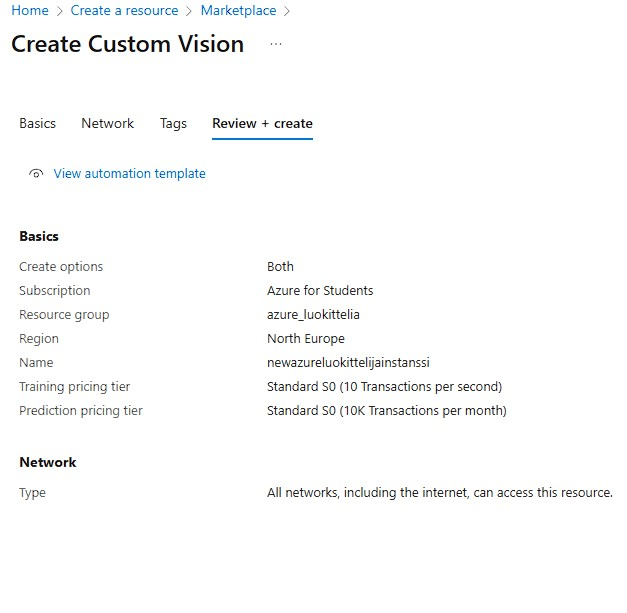
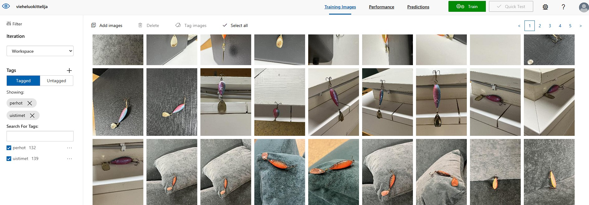
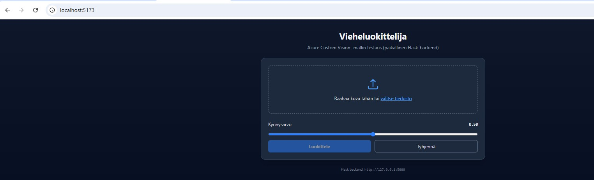
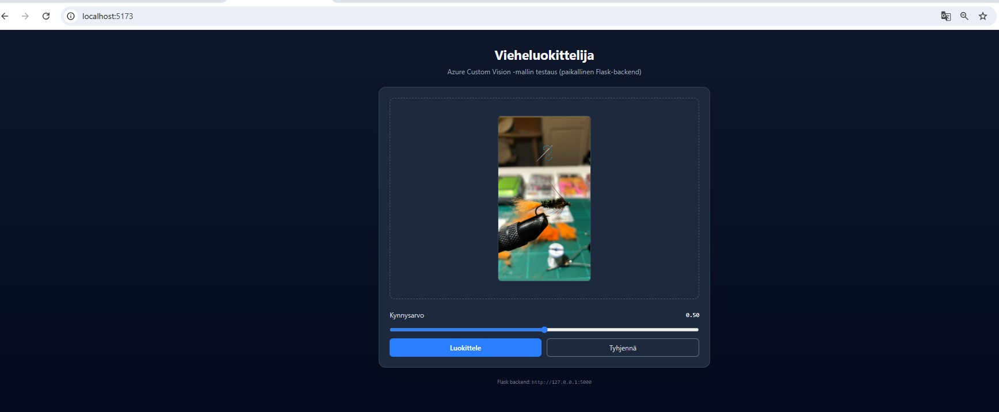
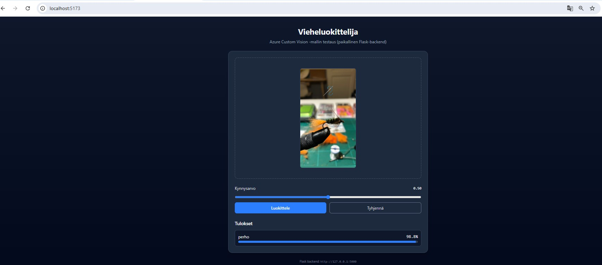
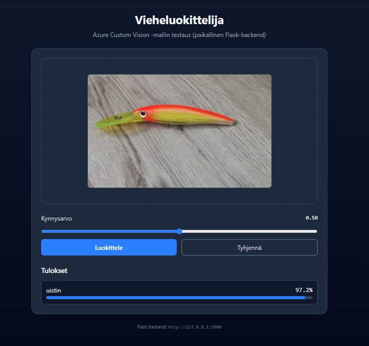

# Vieheluokittelija

Azure Custom Vision -projekti, joka tunnistaa vieheet ja perhot kuvista.  
Frontend on toteutettu **React + TailwindCSS (Vite)** -teknologioilla ja backend **Flaskilla** paikallista Azure API -kutsua varten.

---

## 🧠 Projektin kuvaus

Tämä projekti hyödyntää **Azure Custom Vision** -palvelua luokittelemaan kuvia kahteen luokkaan:  
*uistimet* ja *perhot*. 

Sovellus on jaettu kahteen osaan:
1. **Azure Custom Vision** – mallin koulutus, testaus ja julkaisu  
2. **Paikallinen sovellus (React + Flask)** – kuvien lähetys mallille ja tulosten näyttäminen

---

## 🧰 Käytetyt teknologiat

| 🌩️ Pilvipalvelu | **Azure Custom Vision** | Kuvien luokittelu (mallin koulutus ja julkaisu) |
| 💻 Frontend | **React + TailwindCSS (Vite)** | Käyttöliittymä kuvan lataukseen ja tulosten näyttöön |
| ⚙️ Backend | **Flask (Python)** | API, joka kutsuu Azure Prediction -rajapintaa |
| 🧪 Testaus | **localhost (Vite + Flask)** | Paikallinen kehitysympäristö |

---

## 🚀 Projektin luonti ja asennus

Projektin käynnistäminen koostuu **kolmesta päävaiheesta**:
1️⃣ Azure-resurssin luominen  
2️⃣ Custom Vision -projektin luominen  
3️⃣ Paikallisen sovelluksen (React + Flask)  

---

### ☁️ 1️⃣ Luo Custom Vision -resurssi Azure-portaalissa https://portal.azure.com/

etsi  **Custom Vision** ja luo uusi resurssi.

https://portal.azure.com/

  
   
  <em>Kuva 1. Custom Vision -resurssin luonti Azure-portaalissa</em>

Tämä vaihe luo taustalle **Custom Vision API -palvelun**

---

### 🧠 2️⃣ Luo Custom Vision -projekti (customvision.ai)

luo uusi projekti

  
   
  <em>Kuva 2. Custom Vision -projektin luonti customvision.ai-portaalissa</em>

Luo **Tagit** uistin ja perho
lataa koulutuskuvat

  
   
  <em>Kuva 2. Custom Vision -projektin luonti customvision.ai-portaalissa</em>

### 💻 3️⃣ Paikallisen sovelluksen asennus

#### 🧩 Frontend (React + TailwindCSS)
'''bash
# Luo projekti
npm create vite@latest
# Valitse: React + JavaScript
cd <projektikansio>

# Asenna riippuvuudet
npm install

# Asenna TailwindCSS (Vite)
npm install -D tailwindcss @tailwindcss/vite
npx @tailwindcss/upgrade

# Käynnistys
npm run dev

🧩 Backend (Flask)

Luo backend/app.py ja luo .env-tiedosto Azure API-avaimilla (PREDICTION_KEY, ENDPOINT, PROJECT_ID, PUBLISHED_NAME).
# Asenna riippuvuudet
'''bash
python -m venv .venv
.\.venv\Scripts\Activate.ps1
pip install -r .\requirements.txt

# Käynnistys
python app.py

# Sovellus toimii osoitteessa:

Frontend: http://localhost:5173
Backend:  http://127.0.0.1:5000

# 📸 Kuvakaappaukset

  
   
  <em>Frontend</em>

  
   
  <em>Frontend</em>

  
   
  <em>Frontend</em>

  
   
  <em>Frontend</em>

